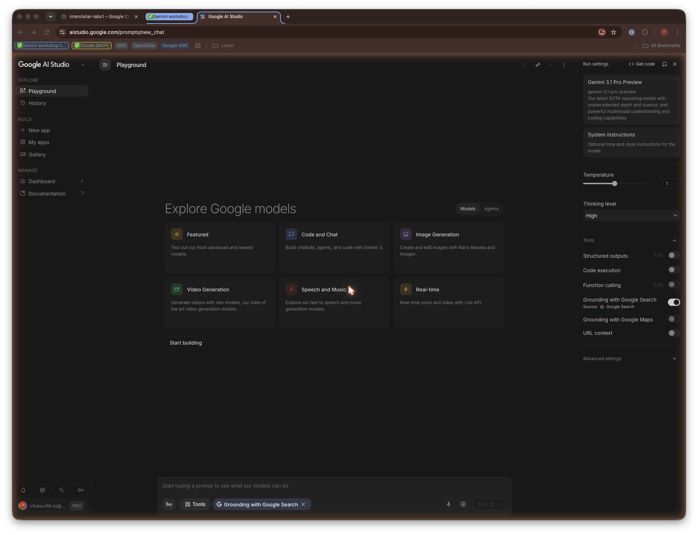
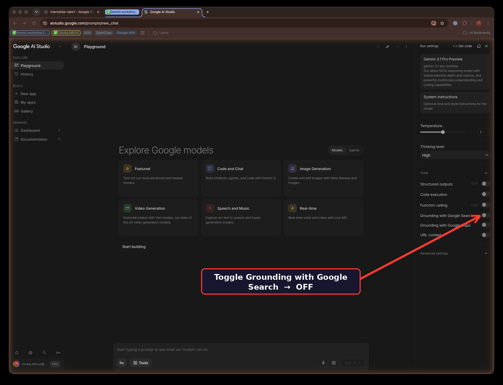
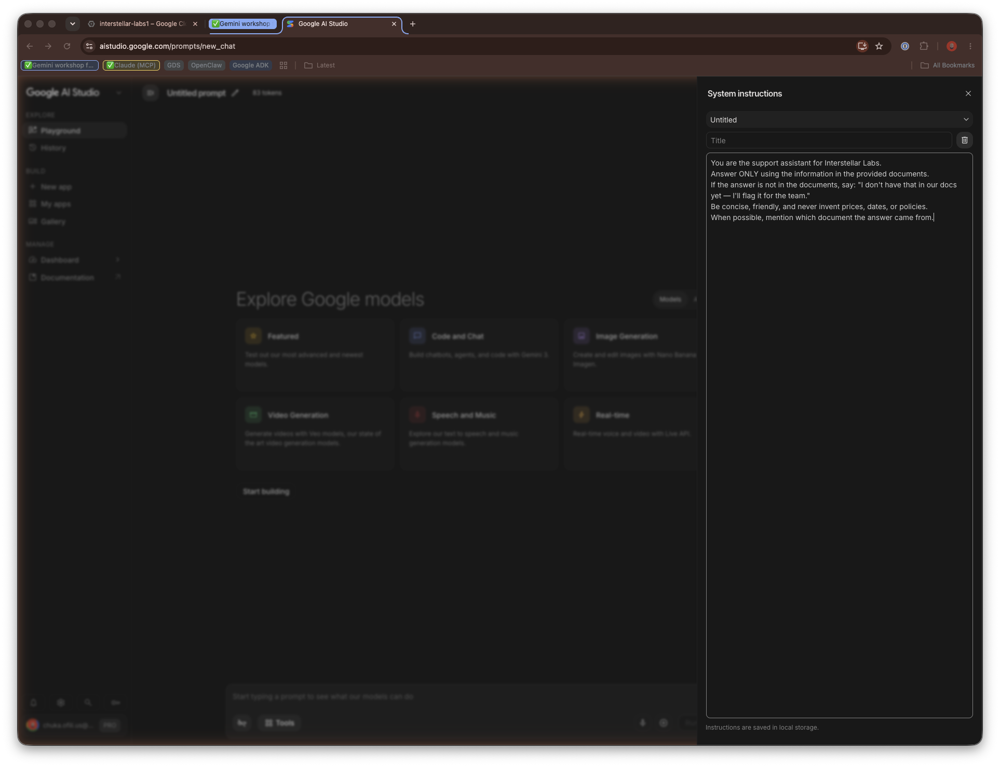
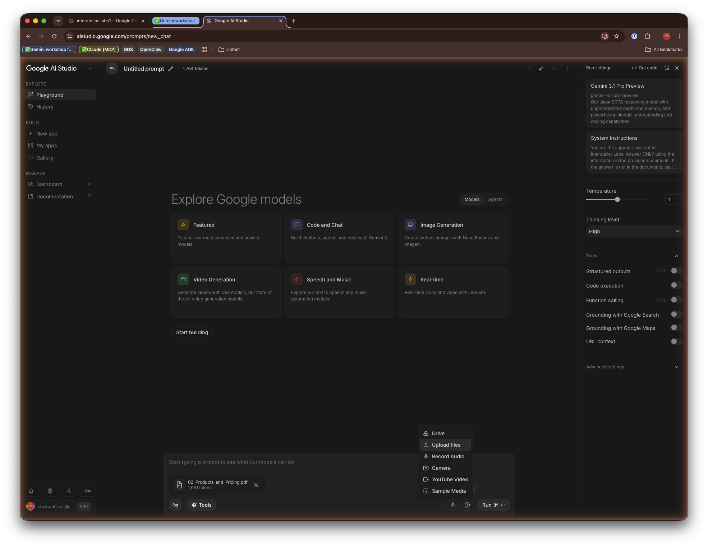
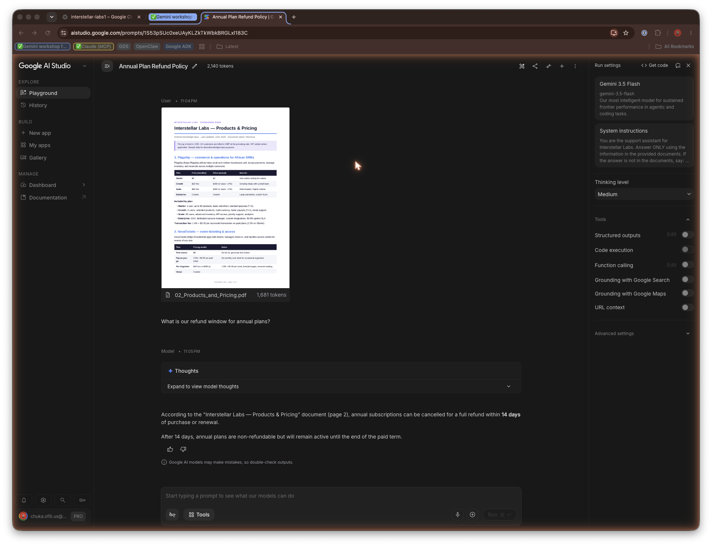
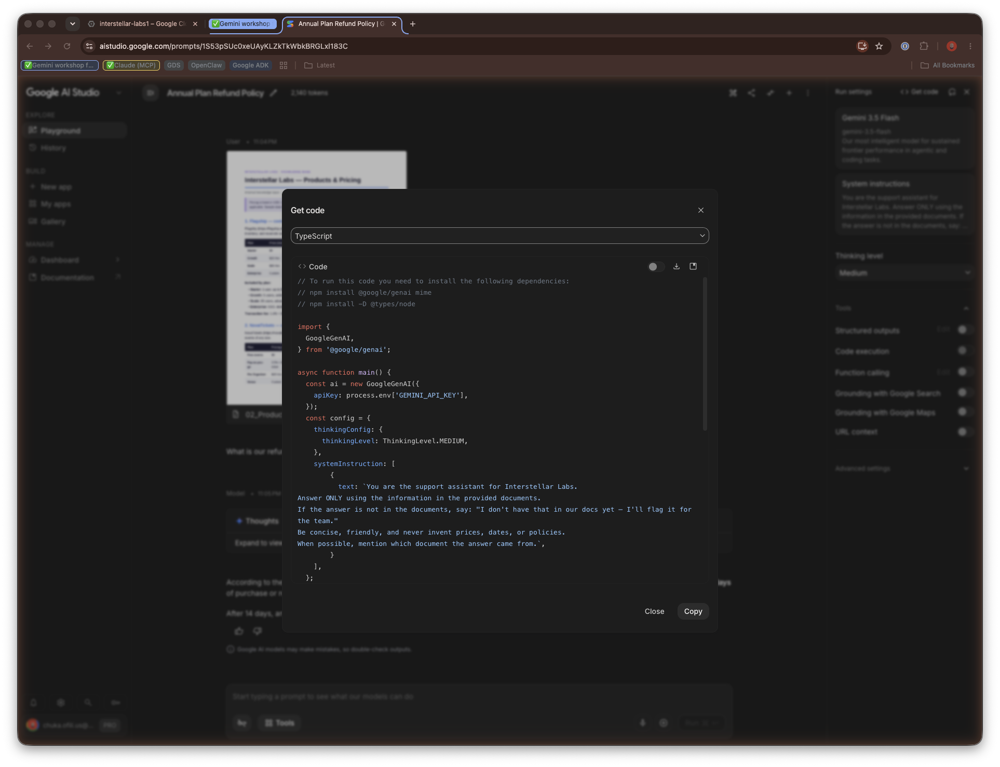

authors: Chuka Ofili
summary: Build a grounded "chat with your docs" RAG assistant in Google AI Studio with no code, then take it to production with the Gemini API and File Search.
id: chatbot-with-rag
categories: gemini,ai,rag
environments: Web
status: Published
feedback link: https://github.com/chukaofili/labs/issues

# Build a "Chat With Your Docs" Assistant — No Code, in Google AI Studio

## Overview
Duration: 0:02:00

A chatbot that answers questions **using only your own documents** — your pricing, your FAQ, your onboarding guide — instead of making things up. This pattern is called **RAG (Retrieval-Augmented Generation)** or **Document Grounding**: the model looks at *your* specific content, then writes an answer grounded in it.

By the end you'll have a working assistant ready for prototyping, plus a clear mental model of how to hand this off to your engineering team.

This is the fastest way to turn a pile of company docs into a support bot, an internal "ask-me-anything," or a customer-facing assistant — without hiring an ML team.

### What you'll build

- A chatbot that answers **only** from documents you provide, and **cites its source**.
- A version that politely says "I don't know" instead of inventing answers.
- An optional mode that mixes in live web facts via Google Search grounding.
- A clear path from prototype → API code → production handoff.

### What you'll need

- A Google account.
- A laptop with a browser (no install required).
- 1–3 documents about your startup (pitch deck, FAQ, product doc, or policy — PDF, Google Doc, or text).

### What you'll learn

- Why a raw model can't answer business-specific questions.
- How to write strong System Instructions that prevent hallucination.
- How to ground a model in your own documents.
- How to turn live web grounding on and off.
- How the no-code build maps 1:1 to the API call your engineer ships.

> aside positive
>
> No credit card and no code required. Everything in the hands-on portion runs in the free Google AI Studio playground.

## How grounding works
Duration: 0:03:00

Keep three ideas in mind before you start:

1. **The model is smart but doesn't know *your* business.** Gemini wasn't trained on your internal pricing or your refund policy.
2. **Grounding fixes this.** You give it a knowledge source. When a user asks a question, the system finds the relevant information and hands it to the model *with* the question.
3. **Grounded answers cite their source.** Good answers point back to the document they came from — so you can trust and verify them.

The whole picture in one line:

**Your docs → uploaded to context → user asks → Gemini answers strictly from your docs.**

## Open Google AI Studio
Duration: 0:02:00

1. Go to [Google AI Studio](https://aistudio.google.com) and sign in with your Google account.
2. If prompted, accept the terms. You're now in the studio — free to experiment.
3. In the left navigation panel under **EXPLORE**, ensure you are on the **Playground** tab.
4. Look at the center of the screen. Next to "Explore Google models," make sure the toggle is set to **Models** (not Agents).



> aside positive
>
> The "Agents" mode spins up a persistent coding sandbox; "Models" is the correct mode for building a chat interface.

> aside positive
>
> **Checkpoint:** You can see the AI Studio interface with a chat/prompt area at the bottom and a right panel for settings.

## Try the model raw, so you feel the problem
Duration: 0:05:00

Before adding your docs, let's prove *why* we need grounding by testing the raw brain of the model.

1. Look at the **Run settings** panel on the right side of the screen under **Tools**.
2. Ensure that **Grounding with Google Search** is toggled **OFF**. We don't want it looking up your website just yet.
3. Locate the main text box at the very bottom of the screen that says **"Start typing a prompt..."**
4. Ask something only your company would know, e.g.: *"What is [Your Startup]'s refund window for annual plans?"*
5. Click the **Run** button on the far right of that bottom text box.



The model either says it doesn't know, or it **makes up** a plausible-sounding answer.

> aside negative
>
> That confident-but-wrong behavior is exactly what grounding prevents — and exactly why you can't ship a raw model as a support bot.

## Set the assistant's behavior with System Instructions
Duration: 0:05:00

System instructions tell the model *who it is* and *how to behave* for the whole conversation.

1. Look at the **Run settings** panel on the right side of your screen.
2. Locate the **System instructions** input field.
3. Paste this starter (edit the brackets for your startup):

```text
You are the support assistant for [Your Startup]. Answer ONLY using the
information in the provided documents. If the answer is not in the documents,
say: "I don't have that in our docs yet - I'll flag it for the team."
Be concise, friendly, and never invent prices, dates, or policies. When
possible, mention which document the answer came from.
```

4. In the model selector dropdown (top of the right panel), choose the latest **Flash** model (e.g., Gemini 3.5 Flash for fast, cheap chat) or a **Pro** model (for deeper reasoning).



The "only answer from the documents" rule is what keeps your bot honest. This single instruction is doing a lot of work.

## Give it your knowledge
Duration: 0:10:00

Now we give the model access to your private company truth.

1. Look back down at the prompt box at the bottom of the screen.
2. Click the **+ (plus) icon** next to the microphone to attach your documents.
3. Select and attach your 1–3 startup documents (PDFs, text files, etc.).
4. Gemini's large context window will now read the whole document and use it as a direct knowledge base.



> aside positive
>
> **Checkpoint:** Your documents are attached and visible in the chat context.

## Ask the same question again
Duration: 0:05:00

1. Re-enter your exact earlier question in the bottom text box: *"What is [Your Startup]'s refund window for annual plans?"*
2. Click **Run**.

The answer now comes straight from your document — correct, specific, and citing the source file.



Try a few more:

- A question whose answer **is** in your docs → it should answer correctly.
- A question whose answer is **not** in your docs → it should say "I don't have that in our docs yet," *not* invent one.

> aside positive
>
> This is the whole game. Same model, same question — the only thing that changed is what it can see.

## Add live web facts with Grounding (optional)
Duration: 0:05:00

Some questions need *fresh* info (today's FX rate, a competitor's latest launch, or industry news).

1. Go back to the **Tools** section in your right-hand settings panel.
2. Toggle ON **Grounding with Google Search**.
3. When you give an AI access to the entire internet, it can get distracted and ignore your uploaded files. To fix this, replace your **System instructions** with this tightened version:

```text
You are the support assistant for [Your Startup].

PRIMARY RULE: You must check the provided documents FIRST for any answers
regarding [Your Startup]'s pricing, policies, features, or internal operations.
Answer using the provided documents if the information exists there.

SECONDARY RULE: If the user asks a general market question, requests a currency
conversion, or asks about current events outside the company documents, you may
use Google Search to provide an accurate, up-to-date answer.

Be concise, friendly, and never invent prices, dates, or policies. Always
clarify if your answer came from internal docs or the web.
```

4. Test it: ask a document question (*"What is our refund policy?"*) and a web question (*"What is the current exchange rate for USD to EUR?"*). The bot now dynamically switches between your private truth and the public web.

## Make it real: hand it off to your engineers
Duration: 0:05:00

Google AI Studio is a prototyping sandbox. Now that your assistant works in the playground, it's time to move it into your actual product.

1. In the top right corner of AI Studio, click **&lt;/&gt; Get code**.
2. Look at the generated snippet. Everything you built by clicking around — your System Instructions and your Google Search tool — is translated into API code.
3. Click **Get API key** (usually in the left navigation menu) to generate a secure key for your workspace.
4. **The Handoff:** Copy that code snippet, your API key, and the raw PDF files. Hand them to your developer.



> aside negative
>
> The "Get code" snippet is a starting point, not production code. It's a single hard-coded request — it still needs productionizing: loading the API key from a secret/env var (never hard-coded), accepting real user messages, keeping conversation history, streaming responses, and handling errors.

For a mini, ready-to-go example of all of that, see [scripts/agent.js](https://github.com/chukaofili/labs/blob/main/codelabs/chatbot-with-rag/scripts/agent.js) — a small multi-turn chat agent built on the SDK's chat-session helper that your developer can run today and grow from.

### Re-uploading your files

When you click "Get code," AI Studio does not download the PDFs you attached. Your developer re-uploads them into your app's environment with the Gemini API. The companion repo ships ready-to-run Node.js scripts that do exactly that, using the current `@google/genai` SDK and the **File Search** tool — the same retrieval-with-citations you built in the playground.

The flow is two steps:

1. [scripts/upload.js](https://github.com/chukaofili/labs/blob/main/codelabs/chatbot-with-rag/scripts/upload.js) — indexes your documents into a File Search store once.
2. [scripts/search.js](https://github.com/chukaofili/labs/blob/main/codelabs/chatbot-with-rag/scripts/search.js) — queries that store for grounded, cited answers as many times as you like.

```bash
cd codelabs/chatbot-with-rag/scripts
npm install             # installs @google/genai and dotenv
cp .env.example .env    # then set GEMINI_API_KEY (get one at aistudio.google.com/apikey)

# 1. Index the documents into a File Search store
node upload.js ../knowledge-base/pdfs/*.pdf

# 2. Paste the FILE_SEARCH_STORE id it prints into .env, then ask a question
node search.js "What is our refund window for annual plans?"
```

Unlike stuffing a whole PDF into every request, File Search retrieves **only the relevant chunks** and returns **citations** — so the answer stays grounded and your token costs stay low as the knowledge base grows.

> aside positive
>
> Need to start over or clear duplicate documents? [scripts/cleanup.js](https://github.com/chukaofili/labs/blob/main/codelabs/chatbot-with-rag/scripts/cleanup.js) tears down the store (`node cleanup.js --yes`) or just empties it while keeping the id (`node cleanup.js --docs --yes`). Run it with no flags first for a safe dry-run preview.

For bulk uploads, review the [Gemini API File Search Guide](https://ai.google.dev/gemini-api/docs/file-search) and the [File API documentation](https://ai.google.dev/api/files). The API allows up to 20GB of stored files per project, so a developer can extend `upload.js` to bulk-index an entire directory at once.

## Advanced: connect to live databases with MCP
Duration: 0:02:00

Right now, your bot answers from static documents and public Google Searches. But what if you want it to check a live user's account balance in Stripe, read a live Jira ticket, or pull data from your private Slack channels?

To do this, your engineering team can use the **Model Context Protocol (MCP)**.

**What is MCP?** It's an open-source standard that acts like a secure, universal plug adapter between AI models and your company's private data sources. Instead of manually uploading PDFs, an MCP server lets the AI safely query your actual databases or internal APIs in real time.

**Your next step:** Setting up MCP requires backend engineering. When you're ready to move beyond static document grounding into live system integration, give your engineering team this objective:

```text
Look into setting up an MCP server for our internal APIs. We want to give our
Gemini bot secure tool-access to our live databases.
```

## Congratulations
Duration: 0:01:00

You built a grounded "chat with your docs" assistant with **zero code**. You now understand:

- Why a raw model can't answer business-specific questions.
- How to write strong System Instructions to prevent hallucination.
- How to ground a model in your own documents.
- How to turn live web grounding on and off.
- The path from prototype → exact code → engineering handoff.
- How to scale into live database connections using MCP.

### Learn more

- [Companion code & sample data](https://github.com/chukaofili/labs/tree/main/codelabs/chatbot-with-rag) — this codelab's sample knowledge base + runnable scripts.
- [Gemini API docs](https://ai.google.dev/gemini-api/docs)
- [File Search (managed RAG)](https://ai.google.dev/gemini-api/docs/file-search)
